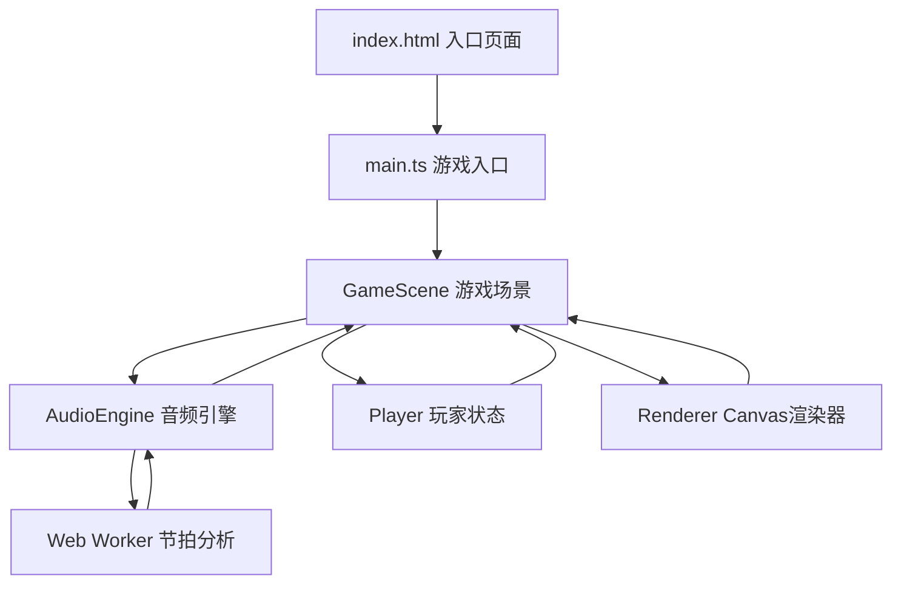

## 1. 架构设计



## 2. 技术选型

- **构建工具**：Vite@5（极速热更新，原生ESM支持）
- **编程语言**：TypeScript@5（严格模式，target ES2020）
- **渲染引擎**：HTML5 Canvas 2D（高性能游戏渲染）
- **音频处理**：Web Audio API + Web Worker（异步节拍分析，避免主线程阻塞）
- **无框架依赖**：纯 TypeScript + Canvas，轻量高效

## 3. 文件结构

```
auto86/
├── package.json          # 项目依赖与脚本配置
├── vite.config.js        # Vite构建配置
├── tsconfig.json         # TypeScript编译配置
├── index.html            # HTML入口页面
└── src/
    ├── main.ts           # 游戏入口，初始化与启动
    ├── audioEngine.ts    # 音频引擎：加载、节拍提取、播放控制
    ├── audioWorker.ts    # Web Worker：音频解码与节拍分析
    ├── gameScene.ts      # 游戏核心逻辑：场景、判定、计分
    ├── renderer.ts       # Canvas渲染：场景、角色、特效绘制
    └── player.ts         # 玩家状态管理：位置、动画、生命
```

## 4. 核心模块定义

### 4.1 AudioEngine 音频引擎
```typescript
interface AudioEngine {
  loadMusic(id: string): Promise<void>;
  play(): void;
  pause(): void;
  getCurrentTime(): number;
  getBeatStatus(): BeatStatus;
  getBeatTimestamps(): number[];
  getEnergyAt(time: number): number;
}

interface BeatStatus {
  currentBeatIndex: number;
  timeToNextBeat: number;
  isNearBeat: boolean;
}
```

### 4.2 GameScene 游戏场景
```typescript
interface GameScene {
  init(audioEngine: AudioEngine, player: Player, renderer: Renderer): void;
  start(): void;
  stop(): void;
  update(deltaTime: number): void;
  handleBeatInput(): void;
  handleJumpInput(): void;
}

interface JudgementResult {
  type: 'perfect' | 'good' | 'ok' | 'miss';
  score: number;
  timeDiff: number;
}
```

### 4.3 Player 玩家
```typescript
interface Player {
  x: number;
  y: number;
  vy: number;
  lives: number;
  isJumping: boolean;
  scale: number;
  flashTimer: number;
  jump(): void;
  update(deltaTime: number): void;
  loseLife(): boolean;
  triggerPerfectFlash(): void;
  triggerLandAnimation(): void;
}
```

### 4.4 Renderer 渲染器
```typescript
interface Renderer {
  resize(width: number, height: number): void;
  clear(): void;
  drawBackground(energy: number): void;
  drawTrack(energy: number, scrollX: number): void;
  drawBeatPlatforms(platforms: Platform[]): void;
  drawObstacles(obstacles: Obstacle[]): void;
  drawStars(stars: Star[]): void;
  drawPlayer(player: Player): void;
  drawHUD(score: number, combo: number, lives: number): void;
  drawPerfectFlash(alpha: number): void;
  drawRipple(x: number, y: number, radius: number, alpha: number): void;
}
```

## 5. 性能优化策略

### 5.1 渲染性能
- 使用 requestAnimationFrame 驱动游戏循环，锁定60fps
- Canvas 离屏缓存静态背景元素，减少重复绘制
- 六边形网格预计算顶点数据，批量绘制
- 对象池复用动态元素（平台、障碍物、星星），避免频繁GC

### 5.2 音频性能
- Web Worker 独立线程处理音频解码与节拍检测算法
- 节拍点预计算为时间戳数组，游戏运行时仅做时间差判定
- 能量数据预计算为 Float32Array，按时间索引O(1)查询
- 节拍同步误差控制在5ms以内

### 5.3 判定系统
- Perfect: ±50ms → 300分
- Good: ±100ms → 150分
- OK: ±150ms → 50分
- Miss: >±150ms → 扣1条命

## 6. 常量配置

```typescript
const CONFIG = {
  CANVAS_RATIO: 16 / 9,
  MIN_WIDTH: 800,
  TRACK_WIDTH_RATIO: 0.8,
  PLAYER_X_RATIO: 1 / 3,
  PLAYER_RADIUS: 12,
  GRAVITY: 0.8,
  JUMP_FORCE: -14,
  SCROLL_SPEED: 5,
  BEAT_PLATFORM_WIDTH: 40,
  BEAT_PLATFORM_HEIGHT: 20,
  OBSTACLE_SIZE: 20,
  STAR_SIZE: 12,
  JUDGE_PERFECT: 50,
  JUDGE_GOOD: 100,
  JUDGE_OK: 150,
  SCORE_PERFECT: 300,
  SCORE_GOOD: 150,
  SCORE_OK: 50,
  SCORE_STAR: 100,
  INITIAL_LIVES: 3,
  COMBO_FLASH_THRESHOLD: 10,
};
```
