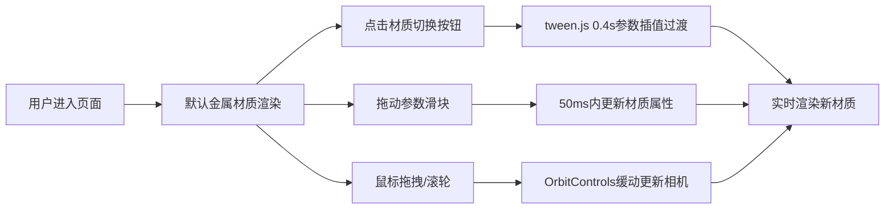

## 1. 产品概述
PBR材质球实时预览应用，面向三维艺术家与设计师，解决在重型3D软件之外快速对比物理材质参数对渲染视觉影响的痛点。用户可通过交互式控制面板实时调节粗糙度、金属度、IOR折射率等参数，观察不同光照环境下球体的反射与折射效果。

## 2. 核心功能

### 2.1 功能模块
1. **3D渲染场景**：中央球体展示、环境光照系统、阴影投射、半透明反射地面
2. **材质切换系统**：金属/玻璃/粗糙岩石三种预设材质，带平滑过渡动画
3. **参数调节面板**：六个滑块实时控制材质与光照参数
4. **视角交互**：鼠标拖拽旋转、右键平移、滚轮缩放，带缓动效果
5. **响应式布局**：桌面端左侧面板，移动端折叠为顶部汉堡菜单

### 2.2 页面详情
| 页面名称 | 模块名称 | 功能描述 |
|-----------|-------------|---------------------|
| 主页面 | 3D渲染区域 | Three.js场景，中央球体+地面+多光源，OrbitControls交互，FPS计数器 |
| 主页面 | 材质切换按钮组 | 三个胶囊按钮，金属/玻璃/岩石，选中高亮，切换时0.4s过渡动画 |
| 主页面 | 参数滑块区 | 粗糙度、金属度、IOR、环境光强度、平行光强度、点光源色相六个滑块 |
| 主页面 | 响应式导航 | <768px时控制面板折叠为汉堡菜单 |

## 3. 核心流程

用户打开页面 → 查看默认金属材质球体 → 点击材质按钮切换（观察过渡动画）→ 拖动滑块微调参数（实时更新）→ 拖拽旋转视角观察不同角度高光 → 滚轮缩放观察细节

## 4. 用户界面设计

### 4.1 设计风格
- 主色调：深蓝紫暗色系（#1A1A2E、#16213E、#222244），突出3D球体的视觉焦点
- 强调色：淡蓝色高光（#6A8DCE、#8AADEE、#4A6FAC）
- 字体：Consolas等宽字体，科技感与精准感
- 布局：左侧280px固定控制面板 + 右侧自适应3D场景
- 视觉效果：半透明磨砂玻璃面板（backdrop-filter: blur）、圆角设计、柔和阴影

### 4.2 页面设计概述
| 页面名称 | 模块名称 | UI元素 |
|-----------|-------------|-------------|
| 主页面 | 控制面板 | 宽度280px，背景#222244半透明磨砂，圆角12px，外边距20px |
| 主页面 | 标签文字 | Consolas 14px，#B0C4DE |
| 主页面 | 滑块样式 | 轨道4px高圆角2px #3A3A5C，按钮直径16px #6A8DCE，hover变#8AADEE |
| 主页面 | 材质按钮 | 胶囊圆角20px，内边距8px 16px，未选#2D2D44文字#8899AA，选中#4A6FAC文字#FFFFFF，点击scale 0.95 |
| 主页面 | FPS计数器 | 右上角12px #AAFFAA，透明度0.7 |

### 4.3 响应式
桌面优先设计，屏幕宽度低于768px时：
- 控制面板折叠为顶部可展开汉堡菜单
- 展开后覆盖在场景上方
- 3D场景占满全屏

### 4.4 3D场景指南
- 环境：深灰渐变背景（#1A1A2E→#16213E），营造专业暗房氛围
- 光照：环境光(0.3) + 左上角45°平行光(1.0) + 右侧淡蓝色点光源(0.8, #4A90D9)
- 阴影：PCSS软阴影，阴影贴图2048x2048
- 相机：OrbitControls，easeOutCubic缓动0.2秒
- 地面：半透明反射平面（#2D2D44，透明度0.5，反射强度0.3）
- 特效：菲涅尔边缘发光效果，由roughness间接控制强度
- 性能：稳定55fps+，材质更新延迟<50ms
