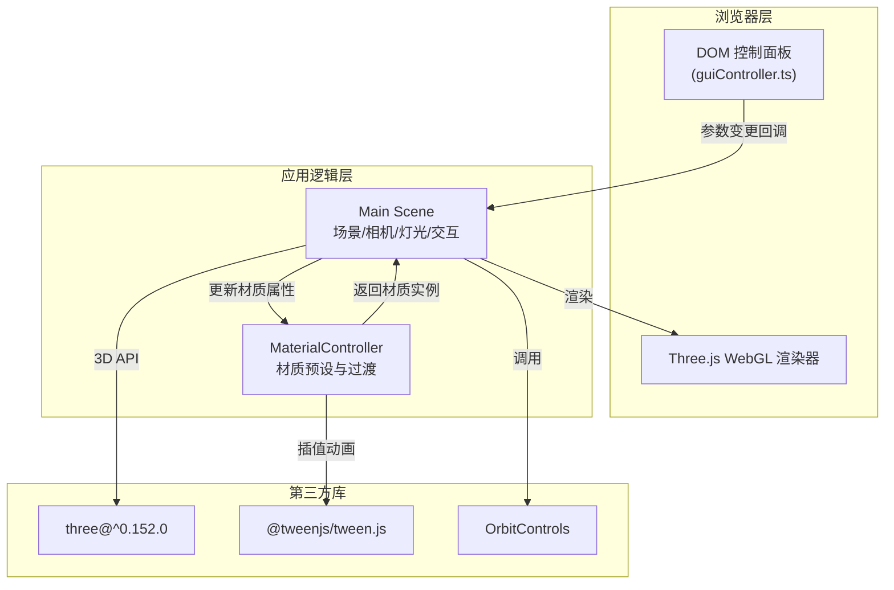

## 1. 架构设计



## 2. 技术描述
- 前端框架：原生 TypeScript + Three.js（不使用React，用户明确指定文件结构）
- 构建工具：Vite
- 核心库：
  - three@^0.152.0：3D渲染引擎
  - @tweenjs/tween.js：材质切换平滑插值动画
  - OrbitControls（three/examples）：相机轨道控制
- 类型支持：TypeScript 严格模式，target ES2020
- 无后端、无数据库，纯前端单页应用

## 3. 路由定义
纯单页应用，无路由。所有逻辑在单个页面完成。

| 路径 | 用途 |
|-------|---------|
| / | 主应用页面（3D场景 + 控制面板） |

## 4. 文件结构

```
auto88/
├── package.json              # 项目依赖与脚本
├── vite.config.js            # Vite构建配置
├── tsconfig.json             # TypeScript严格模式配置
├── index.html                # 入口页面，包含3D场景div与控制面板div
└── src/
    ├── main.ts               # 主入口：初始化场景/相机/渲染器/灯光/地面/控制器，主循环
    ├── materialController.ts # 材质控制器：三种预设，tween.js平滑过渡
    └── guiController.ts      # GUI控制器：渲染HTML控件，绑定事件，回调传参
```

## 5. 核心模块接口

### 5.1 MaterialController
```typescript
type MaterialType = 'metal' | 'glass' | 'rock';

interface MaterialPreset {
    roughness: number;
    metalness: number;
    color: string;
    ior?: number;
    transparent?: boolean;
    opacity?: number;
}

class MaterialController {
    constructor();
    getMaterial(): THREE.MeshStandardMaterial;  // 返回当前材质实例
    applyPreset(type: MaterialType): void;      // 切换预设，0.4s过渡
    setRoughness(value: number): void;          // 直接设置粗糙度
    setMetalness(value: number): void;          // 直接设置金属度
    setIOR(value: number): void;                // 直接设置IOR（玻璃生效）
    setColor(hex: string): void;                // 直接设置颜色
}
```

### 5.2 GUIController
```typescript
interface GUIParams {
    roughness: number;
    metalness: number;
    ior: number;
    ambientIntensity: number;
    directionalIntensity: number;
    pointLightHue: number;
    materialType: MaterialType;
}

type ParamChangeCallback = (params: Partial<GUIParams>) => void;

class GUIController {
    constructor(container: HTMLElement, onChange: ParamChangeCallback);
    getParams(): GUIParams;
    setParams(params: Partial<GUIParams>): void; // 同步UI显示
}
```

## 6. 数据流向

DOM事件（滑块input/按钮click）
    → GUIController解析数值
    → 回调main.ts更新函数
    → 调用MaterialController更新属性 / 直接更新灯光
    → Three.js下一帧重渲染场景
    → 用户视觉反馈（<50ms延迟）
