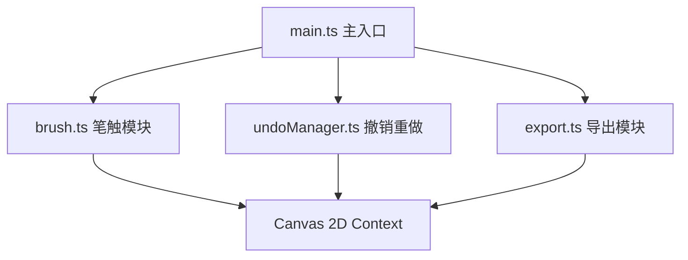

## 1. 架构设计



## 2. 技术描述

- **前端**：TypeScript + HTML5 Canvas + Vite
- **构建工具**：Vite
- **无后端**：纯前端实现，所有逻辑在浏览器端运行

## 3. 文件结构

| 文件路径 | 用途 |
|-------|------|
| package.json | 项目依赖和脚本配置 |
| index.html | 入口页面，包含全屏暗色背景和 Canvas 容器 |
| vite.config.js | 构建配置，入口 index.html，开发端口 3000 |
| tsconfig.json | TypeScript 严格模式，target ES2020 |
| src/main.ts | 初始化画布、工具栏、事件绑定，协调各模块 |
| src/brush.ts | 笔触参数管理、动态线宽计算、墨点生成与动画 |
| src/undoManager.ts | 笔画数据撤销/重做栈，历史状态切换 |
| src/export.ts | 画布内容导出为透明背景 PNG |
| src/styles.css | 页面布局、色彩主题、毛玻璃效果、过渡动画 |

## 4. 核心数据模型

### 4.1 笔画数据结构

```typescript
interface Point {
  x: number;
  y: number;
  pressure?: number;
  timestamp: number;
}

interface Stroke {
  points: Point[];
  color: string;
  baseWidth: number;
}

interface InkSplash {
  x: number;
  y: number;
  radius: number;
  color: string;
  startTime: number;
  duration: number;
}
```

### 4.2 撤销/重做栈

```typescript
interface HistoryState {
  strokes: Stroke[];
}
```
