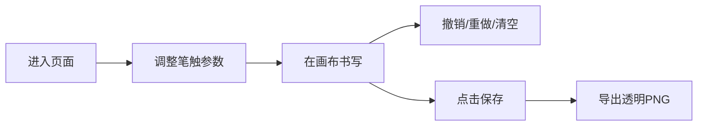

## 1. 产品概述

基于鼠标轨迹生成动态个性签名的交互页面，用户可在深色画布上用鼠标自由书写，系统实时将轨迹转换为流畅的毛笔风格笔画，支持墨点飞溅、渐隐拖尾效果，最终可保存为透明背景 PNG 签名图片。

- 主要目的：提供一个简洁优雅的在线签名生成工具
- 目标用户：需要个性化电子签名的个人用户、设计师

## 2. 核心功能

### 2.1 功能模块

1. **签名画布**：Canvas 绘制区域，支持鼠标书写、动态笔触、墨点飞溅、拖尾效果
2. **工具栏**：笔触粗细滑块、墨色选择器、清空按钮、保存按钮
3. **撤销/重做**：Z 键撤销（最多10步）、Ctrl+Z 重做（最多5步）
4. **导出功能**：保存为透明背景 PNG 图片

### 2.2 页面详情

| 页面名称 | 模块名称 | 功能描述 |
|-----------|-------------|---------------------|
| 签名主页 | 工具栏 | 笔触粗细滑块（2-20px，默认8px）、墨色选择（黑/深红/靛蓝/金）、清空按钮、保存按钮 |
| 签名主页 | 画布区域 | 90vw×60vh 居中画布，支持鼠标书写，毛笔风格动态笔触，墨点飞溅，渐隐拖尾 |
| 签名主页 | 状态栏 | 底部显示当前笔画数（格式：笔画：3/10） |

## 3. 核心流程

用户进入页面 → 在画布上用鼠标书写签名 → 可通过工具栏调整笔触参数 → 书写完成后点击保存 → 自动下载透明背景 PNG 图片

## 4. 用户界面设计

### 4.1 设计风格

- **主色**：背景 #1A1A2E，画布区域 #0F0F1A，边框 #2A2A5A
- **强调色**：清空按钮红色 #E74C3C（hover #C0392B），保存按钮绿色 #27AE60（hover #1E8449）
- **墨色选项**：黑色 #1A1A1A、深红 #8B0000、靛蓝 #1B3A5C、金色 #D4AF37
- **风格**：深色极简，毛玻璃工具栏，圆角设计，微弱蓝色边框

### 4.2 页面设计概述

| 页面名称 | 模块名称 | UI 元素 |
|-----------|-------------|-------------|
| 签名主页 | 工具栏 | 半透明毛玻璃背景 rgba(26,26,46,0.8)，吸底阴影，圆角，hover 过渡动画 0.2s |
| 签名主页 | 画布区域 | 宽 90vw，高 60vh，居中对齐，圆角 16px，边框 #2A2A5A |
| 签名主页 | 状态栏 | 底部显示笔画数，与深色背景融合 |

### 4.3 响应式

- 桌面端优先设计
- 画布使用视口单位自适应
