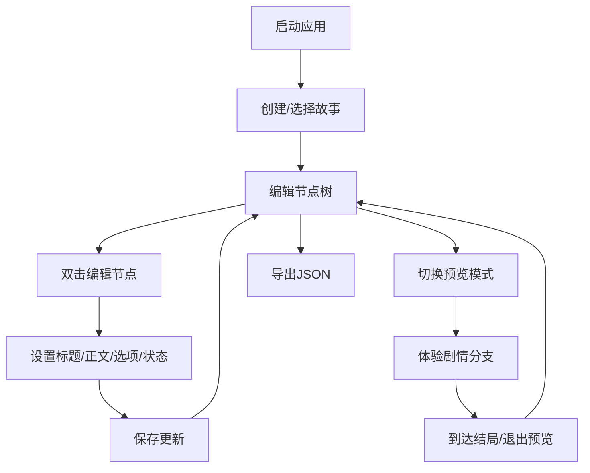

## 1. 产品概述

一款面向独立游戏策划师的轻量级回合制文字冒险游戏编辑器，支持玩家在线创建和体验分支剧情（类似互动小说），通过树状节点管理剧情选项、状态变量与结局分支。

- 核心目标：提供直观的可视化节点编辑器，让非技术用户也能快速构建互动叙事内容
- 目标用户：独立游戏策划师、互动小说作者、教育内容创作者
- 市场价值：降低互动叙事创作门槛，提供从编辑到预览的一站式体验

## 2. 核心功能

### 2.1 用户角色
| 角色 | 注册方式 | 核心权限 |
|------|----------|----------|
| 创作者 | 无需注册，本地使用 | 创建、编辑、删除故事；导入导出JSON；预览游戏 |

### 2.2 功能模块
1. **故事管理模块**：创建新故事、故事列表展示、搜索过滤、删除故事
2. **节点树编辑器**：可视化节点卡片、分支连线、拖拽排序、双击编辑
3. **节点编辑模态框**：标题编辑、正文编辑（支持Markdown）、选项管理、状态变量设置
4. **预览模式**：玩家视角体验、状态变量跟踪、结局统计展示
5. **导入导出**：JSON格式导出、JSON文件导入覆盖

### 2.3 页面详情
| 页面名称 | 模块名称 | 功能描述 |
|----------|----------|----------|
| 主编辑页面 | 左侧边栏 | 故事列表、搜索框、创建按钮、删除操作 |
| 主编辑页面 | 顶部工具栏 | 预览/编辑切换、导入按钮、导出按钮 |
| 主编辑页面 | 中央编辑区 | 节点树可视化展示、节点卡片、连线 |
| 主编辑页面 | 节点编辑模态框 | 标题、正文、选项列表、状态变量编辑 |
| 主编辑页面 | 预览模式 | 剧情展示、选项按钮、状态跟踪、结局统计 |

## 3. 核心流程

### 3.1 创作流程
用户启动应用 → 创建新故事（输入标题简介）→ 进入编辑器 → 添加/编辑剧情节点 → 设置选项分支和状态变量 → 切换预览模式测试 → 导出JSON保存

### 3.2 游戏流程
预览模式开始 → 显示开场节点 → 阅读正文 → 选择选项 → 跳转到下一节点并应用状态变化 → 循环直到结局 → 显示统计信息

### 3.3 流程图

## 4. 用户界面设计

### 4.1 设计风格
- **主色调**：深色主题，背景#1E1F2A，卡片#2D2E3A，边框#3A3B4E，高亮#7C5CFC紫色
- **按钮风格**：圆角8px，hover上移2px，紫色渐变#7C5CFC→#9B7DFF
- **字体**：现代无衬线字体，正文14px，标题16-18px
- **布局风格**：三栏布局（左侧边栏+顶部工具栏+中央编辑区），卡片式设计
- **图标风格**：使用lucide-react线性图标，简洁现代

### 4.2 页面设计概述
| 页面名称 | 模块名称 | UI元素 |
|----------|----------|--------|
| 主编辑页面 | 左侧边栏 | 半透明毛玻璃(backdrop-filter: blur(8px))，宽280px可折叠，故事卡片hover背景变亮#383950过渡0.2s |
| 主编辑页面 | 节点卡片 | 圆角16px深色卡片，发光阴影0 2px 12px rgba(124,92,252,0.2)，显示标题和选项数 |
| 主编辑页面 | 节点连线 | 圆滑贝塞尔曲线#6A6B8A，线宽2px |
| 主编辑页面 | 编辑模态框 | 半透明遮罩，居中显示，缩放入场动画scale 0.9→1 0.3s cubic-bezier |
| 主编辑页面 | 预览模式 | 纸色背景#F5F0E8，文本#2D2E3A，字体18px居中，选项按钮圆角8px紫色边框 |

### 4.3 响应式
- 桌面优先设计，断点768px
- 移动端：左侧边栏折叠为汉堡菜单，树编辑区占满宽度，节点卡片简化显示
- 触摸优化：增大点击区域，支持触摸拖拽

### 4.4 性能指标
- 50节点树编辑操作响应延迟≤100ms
- 预览模式切换≤1秒
- 50节点JSON导出≤500ms
