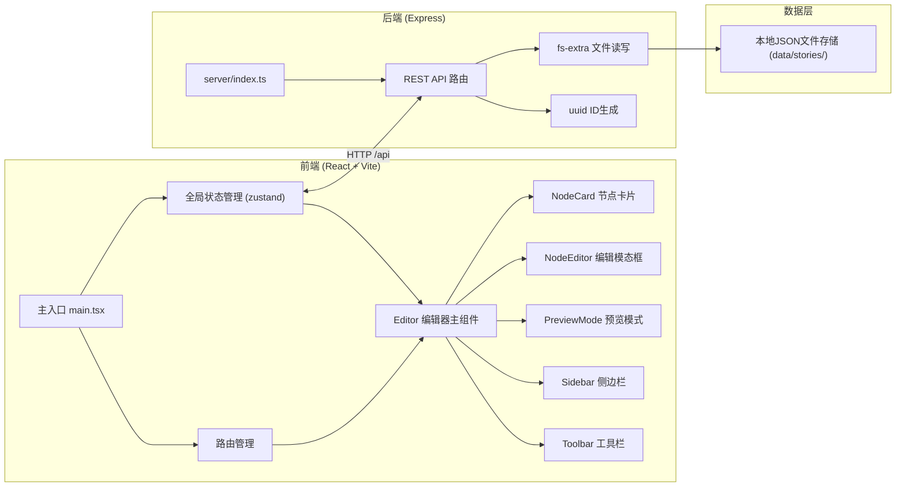
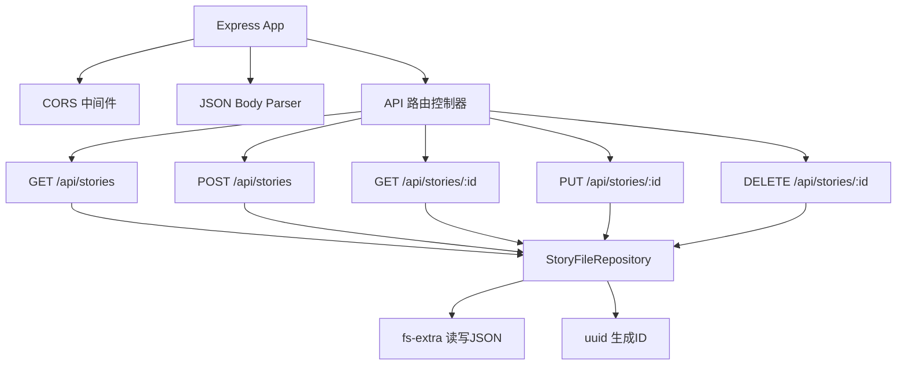
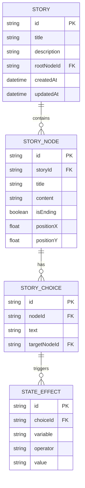

## 1. 架构设计



## 2. 技术说明

- **前端**：React 18 + TypeScript + Vite 5 + zustand（状态管理）+ lucide-react（图标）
- **构建工具**：Vite 5，启用React严格模式，配置/api代理到后端3001端口
- **后端**：Express 4 + TypeScript + uuid + fs-extra + cors
- **数据存储**：本地JSON文件存储于 data/stories/ 目录
- **类型系统**：TypeScript严格模式，target ES2020
- **包管理器**：npm

## 3. 路由定义

前端为单页应用，主要通过内部状态切换视图模式：

| 状态路由 | 用途 |
|----------|------|
| / (默认) | 编辑器主界面，包含故事列表和节点编辑区 |

后端API路由：

| 路由 | 方法 | 用途 |
|------|------|------|
| /api/stories | GET | 获取所有故事列表 |
| /api/stories | POST | 创建新故事 |
| /api/stories/:id | GET | 获取单故事完整数据 |
| /api/stories/:id | PUT | 更新故事数据 |
| /api/stories/:id | DELETE | 删除故事 |

## 4. API 定义

### 4.1 TypeScript 类型定义

```typescript
// 状态变量影响
interface StateEffect {
  variable: string;
  operator: '+' | '-' | '=';
  value: number | boolean | string;
}

// 剧情选项
interface StoryChoice {
  id: string;
  text: string;
  targetNodeId: string | null;
  effects: StateEffect[];
}

// 剧情节点
interface StoryNode {
  id: string;
  title: string;
  content: string;
  choices: StoryChoice[];
  isEnding?: boolean;
  position?: { x: number; y: number };
}

// 故事元数据
interface StoryMeta {
  id: string;
  title: string;
  description: string;
  createdAt: string;
  updatedAt: string;
}

// 完整故事数据
interface Story extends StoryMeta {
  rootNodeId: string;
  nodes: Record<string, StoryNode>;
  initialState: Record<string, number | boolean | string>;
}

// 故事列表项
interface StoryListItem extends StoryMeta {
  nodeCount: number;
}
```

### 4.2 请求/响应示例

**GET /api/stories** 响应：
```json
{
  "stories": [
    {
      "id": "uuid-xxx",
      "title": "神秘古堡探险",
      "description": "一场充满未知的古堡冒险...",
      "createdAt": "2024-01-01T00:00:00Z",
      "updatedAt": "2024-01-01T00:00:00Z",
      "nodeCount": 12
    }
  ]
}
```

**POST /api/stories** 请求：
```json
{
  "title": "故事标题",
  "description": "故事简介（限50字）"
}
```

## 5. 服务器架构



## 6. 数据模型

### 6.1 实体关系图



### 6.2 文件存储结构

每个故事存储为独立JSON文件：
```
data/
  stories/
    {story-id}.json
```

单故事文件结构：
```json
{
  "id": "uuid",
  "title": "故事标题",
  "description": "故事简介",
  "rootNodeId": "node-uuid",
  "createdAt": "ISO timestamp",
  "updatedAt": "ISO timestamp",
  "initialState": {},
  "nodes": {
    "node-id": {
      "id": "node-id",
      "title": "开场",
      "content": "剧情正文...",
      "choices": [],
      "isEnding": false,
      "position": { "x": 100, "y": 100 }
    }
  }
}
```
