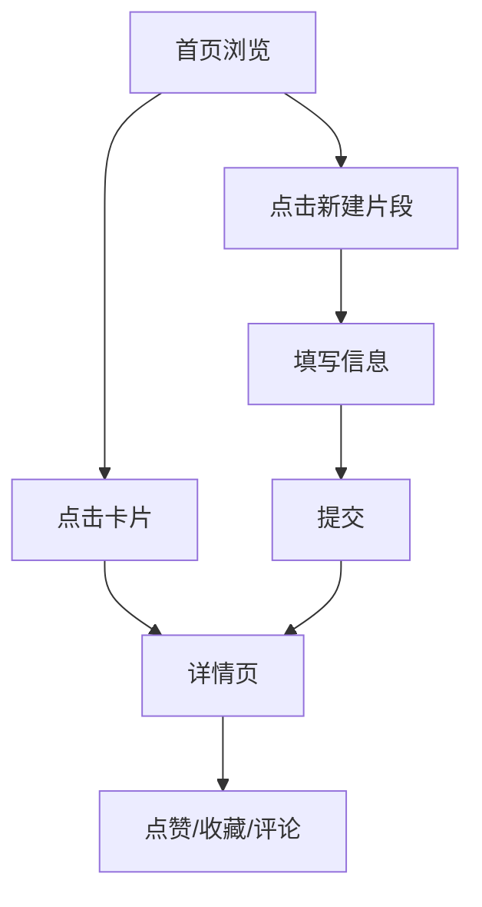

## 1. 产品概述

CodeShare 是一个在线代码片段分享与语法高亮展示平台，允许用户匿名或注册后快速分享代码、查看他人分享的代码片段，并通过评论和标签进行交流互动。

- **核心价值**：提供简洁高效的代码分享体验，支持多语言语法高亮，促进开发者之间的知识交流
- **目标用户**：开发者、编程学习者、技术人员
- **解决问题**：快速分享代码片段、代码高亮展示、代码交流讨论

## 2. 核心功能

### 2.1 用户角色
| 角色 | 注册方式 | 核心权限 |
|------|----------|----------|
| 匿名用户 | 无需注册 | 浏览代码片段、匿名发布代码、匿名评论 |
| 注册用户 | 用户名注册 | 浏览代码片段、发布代码、评论、点赞、收藏 |

### 2.2 功能模块
1. **首页**：代码片段列表、标签过滤、分页、导航栏
2. **新建代码片段页**：标题输入、代码编辑器、语言选择/自动检测、标签输入、提交
3. **代码详情页**：完整代码展示、语法高亮、评论区、点赞、收藏

### 2.3 页面详情
| 页面名称 | 模块名称 | 功能描述 |
|-----------|-------------|---------------------|
| 首页 | 导航栏 | Logo、新建片段按钮、毛玻璃效果 |
| 首页 | 代码卡片列表 | 每行3张卡片、响应式布局、悬停动效、显示标题/语言/代码预览/点赞数/评论数/时间/标签 |
| 首页 | 标签过滤 | 点击标签按URL参数过滤 |
| 首页 | 分页 | 每页12个，最多渲染100个 |
| 新建页 | 标题输入 | 深色背景、聚焦高亮边框 |
| 新建页 | 代码编辑器 | Textarea、等宽字体、Tab键支持、自动缩进 |
| 新建页 | 语言选择 | 下拉菜单、自动检测（基于关键词） |
| 新建页 | 标签输入 | 逗号分隔，最多3个 |
| 新建页 | 提交按钮 | 绿色渐变、过渡动画 |
| 详情页 | 代码展示区 | 完整代码、Prism高亮、行号、可滚动 |
| 详情页 | 元信息 | 标题、语言、作者、发布时间 |
| 详情页 | 互动功能 | 点赞（蓝色）、收藏（金色） |
| 详情页 | 评论区 | 评论列表（正序）、评论输入框、提交按钮 |

## 3. 核心流程

用户在首页浏览代码片段 → 点击卡片或链接进入详情页 → 查看代码、点赞/收藏/评论；或点击"新建片段" → 填写标题、代码、标签 → 选择语言（或自动检测）→ 提交 → 跳转详情页。

## 4. 用户界面设计

### 4.1 设计风格
- **主色调**：深色主题，背景 #0D1117，卡片背景 #161B22
- **文字色**：#E6EDF3
- **强调色**：蓝色 #4A90D9（按钮、点赞）、绿色 #27AE60（提交）、金色 #F1C40F（收藏）
- **语言标签色**：JS #F7DF1E、Python #306998、HTML #E34F26、CSS #2965F1
- **按钮样式**：圆角 8px，过渡 0.2s，hover 变色
- **字体**：代码用 'Fira Code' 等宽字体
- **布局风格**：卡片式布局，顶部导航栏
- **图标风格**：lucide-react 图标库（大拇指、星星等）

### 4.2 页面设计概览
| 页面名称 | 模块名称 | UI 元素 |
|-----------|-------------|-------------|
| 首页 | 导航栏 | 固定54px，毛玻璃 rgba(13,17,23,0.8)，底部阴影，Logo左，按钮右 |
| 首页 | 代码卡片 | 悬停上移4px + 阴影增强，过渡0.3s，语言圆点，代码预览5行 |
| 新建页 | 表单区 | 标题输入框背景#2D2D2D，代码区背景#1E1E1E文字#A6E22E |
| 详情页 | 代码块 | 背景#1E1E1E，最大高度500px滚动，行号显示 |
| 详情页 | 评论 | 圆形头像32px，用户名白色，时间灰色12px |

### 4.3 响应式设计
- 桌面端：每行3张卡片
- ≤768px：每行2张卡片
- ≤480px：每行1张卡片

### 4.4 交互与动画
- 页面切换：淡入淡出，opacity 0→1，0.3s
- 卡片悬停：上移4px + 阴影增强，0.3s ease-out
- 按钮：hover 变色，0.2s 过渡
- 滚动条：自定义样式，宽8px，滑块#3E3E3E圆角4px
- 输入框focus：outline 2px solid #4A90D9，outline-offset 2px
