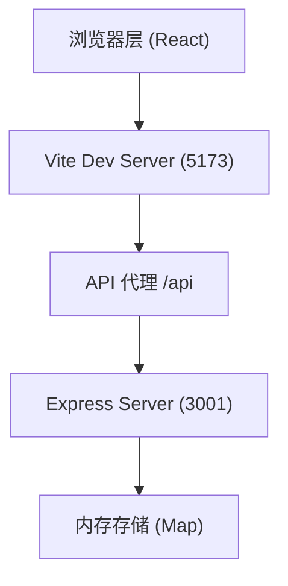
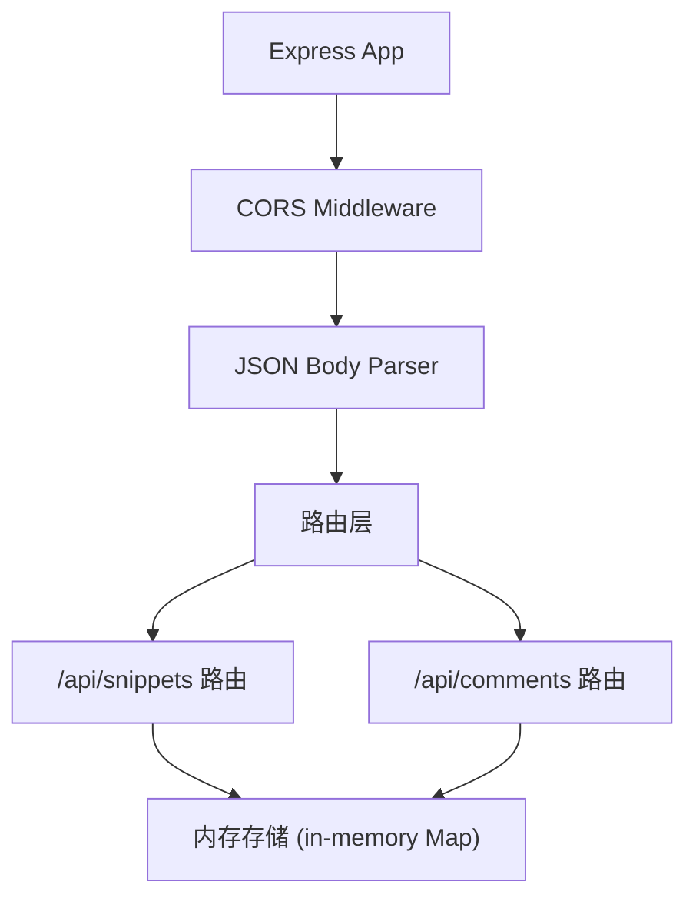
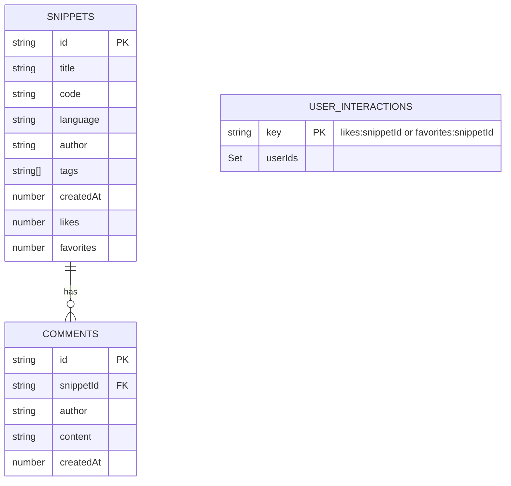

## 1. 架构设计



## 2. 技术栈说明

- **前端框架**：React 18 + TypeScript
- **构建工具**：Vite
- **路由**：React Router v6
- **语法高亮**：Prism.js + @types/prismjs
- **图标**：lucide-react
- **后端**：Express 4 + TypeScript
- **跨域**：cors
- **ID 生成**：uuid
- **并发启动**：concurrently
- **数据存储**：内存 Map（无持久化数据库）

## 3. 路由定义

| 路由 | 页面组件 | 用途 |
|-------|---------|------|
| `/` | HomePage | 首页，代码片段列表，支持标签过滤和分页 |
| `/new` | NewSnippetPage | 新建代码片段页面 |
| `/snippet/:id` | SnippetDetailPage | 代码片段详情页 |

## 4. API 定义

### 4.1 类型定义

```typescript
interface Snippet {
  id: string;
  title: string;
  code: string;
  language: 'javascript' | 'python' | 'html' | 'css';
  author: string;
  tags: string[];
  createdAt: number;
  likes: number;
  favorites: number;
}

interface Comment {
  id: string;
  snippetId: string;
  author: string;
  content: string;
  createdAt: number;
}
```

### 4.2 接口列表

| 方法 | 路径 | 说明 | 请求体 | 响应 |
|------|------|------|--------|------|
| GET | `/api/snippets` | 获取所有代码片段（按时间倒序） | - | `Snippet[]` |
| POST | `/api/snippets` | 创建新代码片段 | `{title, code, language, author, tags}` | `Snippet` |
| GET | `/api/snippets/:id` | 获取单个代码片段详情 | - | `Snippet` |
| POST | `/api/snippets/:id/like` | 点赞/取消点赞 | `{liked: boolean}` | `{likes: number}` |
| POST | `/api/snippets/:id/favorite` | 收藏/取消收藏 | `{favorited: boolean}` | `{favorites: number}` |
| GET | `/api/comments?snippetId=xxx` | 获取某片段的评论列表 | - | `Comment[]` |
| POST | `/api/comments` | 发表评论 | `{snippetId, author, content}` | `Comment` |

## 5. 服务器架构



## 6. 数据模型

### 6.1 内存存储结构



### 6.2 语言自动检测规则

| 语言 | 关键词/特征 |
|------|------------|
| Python | `def `, `class `, `import `, `print(`, `self.`, `elif `, `except ` |
| HTML | `<html`, `<div`, `<span`, `<body`, `<!DOCTYPE`, `<script`, `<style` |
| CSS | `@media`, `@keyframes`, `{`, `}`, `:`, `;`, `.class`, `#id` |
| JavaScript | `function `, `const `, `let `, `var `, `import `, `export `, `=>`, `console.` |

## 7. 项目文件结构

```
.
├── package.json
├── index.html
├── vite.config.js
├── tsconfig.json
├── src/
│   ├── main.tsx          # React入口
│   ├── App.tsx           # 路由配置
│   ├── index.css         # 全局样式
│   ├── components/
│   │   ├── Navbar.tsx       # 导航栏
│   │   ├── SnippetCard.tsx  # 代码卡片
│   │   ├── CodeBlock.tsx    # 语法高亮代码块
│   │   ├── LanguageBadge.tsx# 语言标签
│   │   ├── TagBadge.tsx     # 标签胶囊
│   │   ├── CommentItem.tsx  # 评论项
│   │   └── Pagination.tsx   # 分页组件
│   ├── pages/
│   │   ├── HomePage.tsx         # 首页
│   │   ├── NewSnippetPage.tsx   # 新建页
│   │   └── SnippetDetailPage.tsx# 详情页
│   ├── hooks/
│   │   └── usePrismHighlight.ts # Prism高亮Hook
│   ├── utils/
│   │   ├── detectLanguage.ts    # 语言检测
│   │   ├── formatTime.ts        # 相对时间格式化
│   │   └── api.ts               # API请求封装
│   └── types/
│       └── index.ts             # 类型定义
└── server/
    ├── index.ts              # Express服务器入口
    └── store.ts              # 内存存储
```

## 8. 性能优化策略

1. **首页列表**：限制单次最多渲染100条，分页每页12条
2. **Prism高亮**：组件挂载后延迟50ms执行，避免阻塞首次渲染
3. **路由懒加载**：使用React.lazy + Suspense实现页面懒加载，配合淡入淡出动画
4. **内存存储**：使用Map数据结构，O(1)查找效率
5. **响应式图片/布局**：CSS媒体查询实现适配
