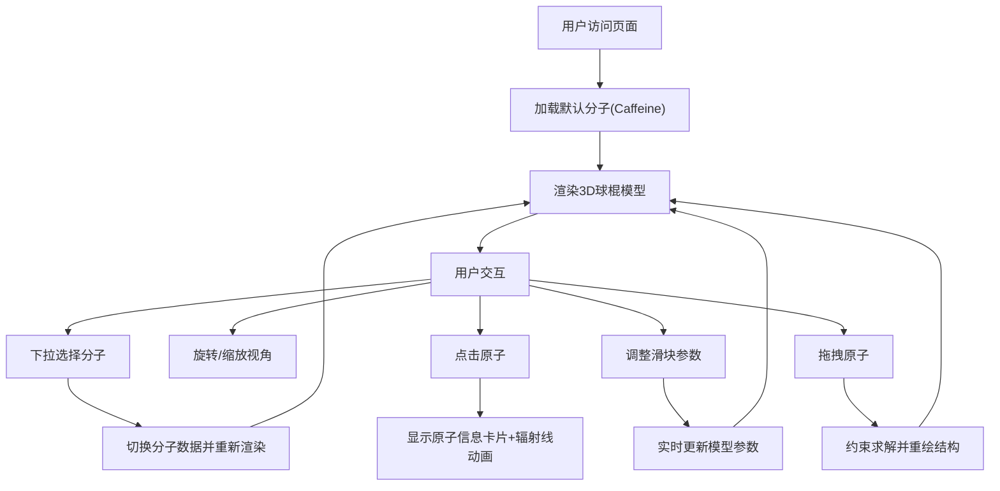

## 1. 产品概述

基于Web的3D分子结构交互式展示与编辑器，面向化学爱好者和学生，支持在浏览器中载入常见分子（Caffeine、Aspirin、Ibuprofen等）的结构数据，并以Three.js渲染为带颜色编码的半透明球棍模型进行交互式探索。

- 核心目的：提供沉浸式的分子结构可视化与编辑体验，帮助学习者理解分子三维结构
- 目标用户：化学爱好者、学生、教育工作者
- 产品价值：无需安装专业软件即可在浏览器中进行分子结构的交互式学习

## 2. 核心功能

### 2.1 用户角色

| 角色 | 注册方式 | 核心权限 |
|------|----------|----------|
| 访客用户 | 无需注册 | 浏览分子、旋转缩放、查看原子信息、调整参数 |

### 2.2 功能模块

1. **主场景页面**：3D分子渲染、视角控制、原子交互
2. **控制面板**：分子选择、键长缩放、旋转速度调节
3. **原子信息卡片**：点击原子弹出详细信息，含视觉反馈动画

### 2.3 页面详情

| 页面名称 | 模块名称 | 功能描述 |
|----------|----------|----------|
| 主场景页面 | 3D分子渲染 | 球棍模型展示、颜色编码、阴影效果、半透明材质 |
| 主场景页面 | 视角控制 | 鼠标拖拽旋转、滚轮缩放、自动旋转 |
| 主场景页面 | 原子交互 | 点击查看信息、拖拽移动原子（受键长键角约束） |
| 控制面板 | 分子选择器 | 下拉选择5种预置分子（Caffeine、Aspirin、Ibuprofen、Ethanol、Benzene） |
| 控制面板 | 键长缩放滑块 | 范围0.8-1.5，步长0.05，默认1.0 |
| 控制面板 | 旋转速度滑块 | 0-5度/秒，步长0.1，默认0 |
| 原子信息卡片 | 信息展示 | 元素符号、原子序号、连接数，含缩放淡入动画和辐射线特效 |

## 3. 核心流程

用户打开页面 → 默认加载第一个分子 → 可通过下拉切换分子 → 通过鼠标旋转/缩放视角 → 点击原子查看信息 → 调整键长和旋转速度参数 → 拖拽原子调整结构

## 4. 用户界面设计

### 4.1 设计风格

- **主色调**：深紫到深蓝径向渐变背景（#1A0B2E 到 #0B0D3A），主按钮色 #6C63FF 带发光效果
- **强调色**：青色 #00FFFF 用于原子信息卡片辐射线特效
- **原子颜色编码**：碳#808080、氧#FF0D0D、氮#3050F8、硫#FFFF30、氢#FFFFFF
- **控制面板**：半透明毛玻璃效果（rgba(255,255,255,0.06)），边框1px solid rgba(255,255,255,0.1)，圆角12px
- **字体**：'Inter'，字号16px
- **滑块样式**：轨道#333，滑块按钮#6C63FF带2px发光阴影
- **信息卡片**：背景rgba(10,10,30,0.9)，圆角8px，内阴影inset 0 0 8px rgba(100,100,255,0.3)

### 4.2 页面设计概述

| 页面名称 | 模块名称 | UI元素 |
|----------|----------|--------|
| 主场景页面 | 3D渲染区 | 全屏Canvas、径向渐变背景、带光照和阴影的球棍模型 |
| 主场景页面 | 左下角控制面板 | 毛玻璃容器、下拉选择器、两个带标签的滑块 |
| 主场景页面 | 原子信息卡片 | 浮动弹窗、缩放淡入动画、三条半透明辐射线 |

### 4.3 响应式

桌面端优先设计，Canvas占满窗口，控制面板固定在左下角（left:24px, bottom:24px）。

### 4.4 3D场景指导

- **环境**：深紫蓝径向渐变背景，营造科技感沉浸式氛围
- **光照设置**：环境光(AmbientLight)强度0.4，方向光(DirectionalLight)强度1.0投射阴影，点光源辅助照明
- **相机设置**：PerspectiveCamera，fov 60，初始距离使分子完整可见
- **相机运动**：OrbitControls支持旋转、缩放、平移，阻尼效果
- **构图与焦点**：分子居中，自动旋转时缓慢展示各角度
- **交互与动画**：原子点击缩放+透明度动画，辐射线淡出动画，拖拽原子实时更新
- **后期处理**：无后期处理，通过材质和光照实现质感
- **性能预算**：50原子+60键场景下≥45FPS，拖拽响应≤50ms
