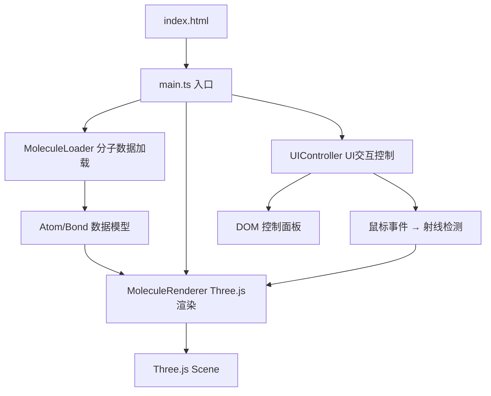
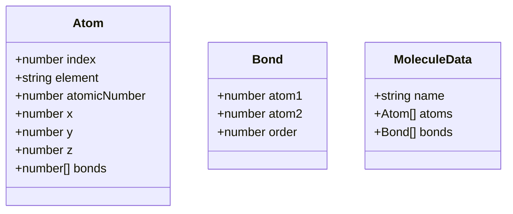

## 1. 架构设计



## 2. 技术描述

- **前端框架**：原生 TypeScript（非React/Vue，用户明确要求纯Three.js实现）
- **3D引擎**：Three.js @latest，配合 @tweenjs/tween.js 做动画插值
- **构建工具**：Vite @latest，dev server 端口 3000
- **类型系统**：TypeScript 严格模式，target ES2020

## 3. 路由定义

| 路由 | 用途 |
|------|------|
| / | 主场景单页应用 |

## 4. 数据模型

### 4.1 核心数据结构



### 4.2 预置分子列表

- Caffeine（咖啡因）
- Aspirin（阿司匹林）
- Ibuprofen（布洛芬）
- Ethanol（乙醇）
- Benzene（苯）

## 5. 文件结构

```
.
├── package.json
├── index.html
├── vite.config.js
├── tsconfig.json
└── src/
    ├── main.ts              # 主入口：场景、相机、控制器、渲染循环
    ├── MoleculeLoader.ts    # 分子数据解析与预置分子库
    ├── MoleculeRenderer.ts  # Three.js网格生成、射线检测、阴影配置
    └── UIController.ts      # UI事件监听、滑块控制、信息卡片
```

## 6. 关键实现要点

### 6.1 MoleculeRenderer
- 使用 SphereGeometry + MeshStandardMaterial 渲染原子（带金属度和粗糙度）
- 使用 CylinderGeometry 渲染化学键，通过矩阵变换放置在两原子连线上
- 启用阴影投射与接收，shadow.bias = 0.0005
- 维护 atomMeshes Map<number, Mesh> 和 bondMeshes Mesh[] 便于更新
- Raycaster 实现点击射线检测，区分原子和键

### 6.2 MoleculeLoader
- 预置5种分子的原子坐标和键连接数据（内置硬编码，无需外部PDB解析）
- 提供 getMolecule(name: string): MoleculeData 接口
- 原子颜色查表：ELEMENT_COLORS = { C: '#808080', O: '#FF0D0D', N: '#3050F8', S: '#FFFF30', H: '#FFFFFF' }
- 原子半径查表（按原子序数比例0.3-0.8）

### 6.3 UIController
- 监听下拉选择器 change 事件切换分子
- 监听滑块 input 事件实时更新 bondScale 和 rotationSpeed
- 监听 canvas 点击事件触发射线检测，调用显示信息卡片
- 信息卡片使用 @tweenjs/tween.js 做 scale + opacity 补间动画（0.2s）
- 辐射线使用三条 Line，材质透明度过渡（0.6s淡出）

### 6.4 性能优化
- 几何体复用：同元素原子共享 SphereGeometry，键共享 CylinderGeometry
- 材质实例复用：同元素原子共享 MeshStandardMaterial
- 拖拽时仅更新受影响原子的 position 和相连键的 matrix
- 目标：50原子+60键场景 ≥ 45FPS
