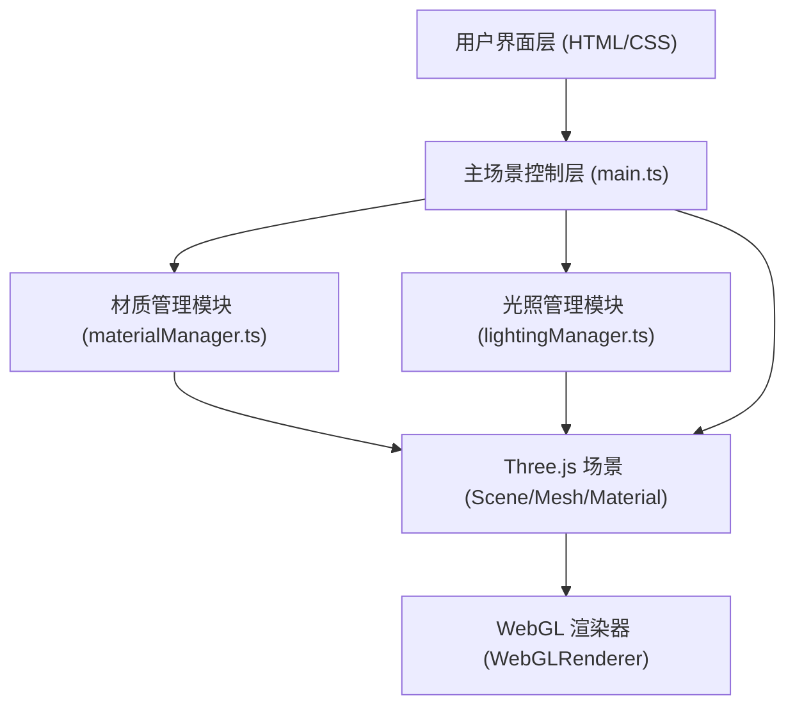

## 1. 架构设计



## 2. 技术说明

- **前端框架**：原生TypeScript + Three.js（无需React/Vue，按用户要求使用指定文件结构）
- **构建工具**：Vite
- **核心库**：three、@types/three、dat.gui、@types/dat.gui、tween.js
- **初始化方式**：通过Vite vanilla-ts模板手动配置

## 3. 项目文件结构

| 文件路径 | 用途 |
|---------|------|
| `package.json` | 项目依赖与脚本配置 |
| `index.html` | 入口HTML页面，包含UI结构与样式 |
| `vite.config.js` | Vite构建配置（端口3000，严格模式） |
| `tsconfig.json` | TypeScript配置（严格模式，target ES2020） |
| `src/main.ts` | 主入口：场景、相机、渲染器、OrbitControls、球体创建、光照设置、窗口自适应 |
| `src/materialManager.ts` | 材质预设管理、滑块UI绑定、参数平滑过渡动画 |
| `src/lightingManager.ts` | 光照预设管理、HSL颜色渐变动画、背景色过渡 |

## 4. 核心数据类型定义

```typescript
// 材质类型
type MaterialType = 'metal' | 'glass' | 'rock';

// 材质参数
interface MaterialParams {
  roughness: number;
  metalness: number;
  ior?: number;
  opacity?: number;
  color: string;
}

// 光照预设类型
type LightingPreset = 'morning' | 'noon' | 'cloudy' | 'moonlight' | 'neon';

// 光照配置
interface LightingConfig {
  ambientColor: string;
  ambientIntensity: number;
  directionalColor: string;
  directionalIntensity: number;
  directionalPosition: [number, number, number];
  pointColor: string;
  pointIntensity: number;
  pointPosition: [number, number, number];
  backgroundColor: string;
}
```

## 5. 模块接口定义

### materialManager.ts
```typescript
export function initMaterialUI(
  mesh: THREE.Mesh,
  container: HTMLElement
): {
  getCurrentMaterial: () => THREE.Material;
  setMaterialType: (type: MaterialType) => void;
  getParams: () => MaterialParams;
}
```

### lightingManager.ts
```typescript
export function initLightingUI(
  scene: THREE.Scene,
  ambient: THREE.AmbientLight,
  directional: THREE.DirectionalLight,
  point: THREE.PointLight,
  renderer: THREE.WebGLRenderer,
  container: HTMLElement
): {
  setPreset: (preset: LightingPreset) => void;
  getCurrentPreset: () => LightingPreset;
}
```

## 6. 性能优化策略

1. **环境贴图动态降级**：FPS < 25时将CubeRenderTarget从1024²降到512²
2. **材质过渡**：使用tween.js在0.3s内平滑插值材质uniforms
3. **颜色插值**：使用THREE.Color的HSL空间插值实现1s光照渐变
4. **渲染循环**：requestAnimationFrame驱动，帧间dt计算保证运动速度一致
5. **内存管理**：旧材质dispose()释放GPU资源
