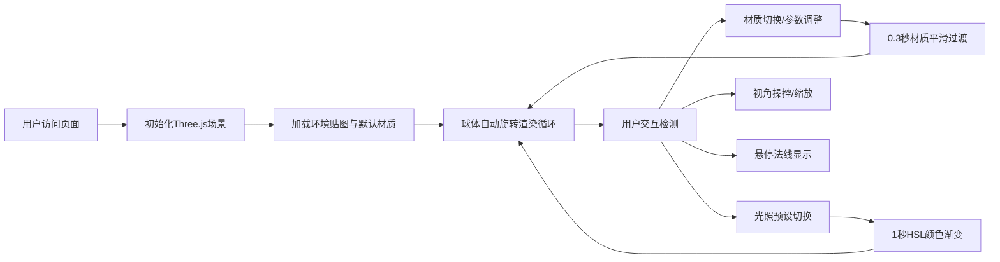

## 1. 产品概述

PBR材质与光照实时预览应用，专为三维艺术家和设计师打造，解决在无需重型3D软件的前提下，快速对比物理材质参数组合对最终渲染视觉影响的痛点。

- 核心目的：提供基于WebGL的实时PBR材质预览，支持金属、玻璃、粗糙岩石三种材质类型与五种光照环境的即时切换
- 目标用户：3D艺术家、游戏设计师、视觉设计师、前端开发者
- 市场价值：大幅降低PBR材质调试成本，秒级可视化材质参数调整效果

## 2. 核心功能

### 2.1 功能模块

1. **主场景页面**：Three.js 3D球体展示、实时材质渲染、光照系统
2. **材质控制模块**：三种材质预设切换（金属/玻璃/岩石）、参数滑块实时调节
3. **光照控制模块**：五种光照环境预设、1秒HSL渐变过渡动画
4. **交互控制模块**：OrbitControls视角操控、球体自动旋转、法线悬停显示
5. **性能监控模块**：FPS实时计数、动态环境贴图分辨率调整

### 2.2 页面详情

| 页面名称 | 模块名称 | 功能描述 |
|---------|---------|---------|
| 主场景页 | 3D球体展示 | 半径2单位球体，支持金属/玻璃/岩石材质实时切换，PBR参数平滑过渡 |
| 主场景页 | 材质控制面板 | 右侧悬浮面板，粗糙度/金属度/IOR/透明度滑块，数值实时更新显示 |
| 主场景页 | 光照预设选择器 | 顶部毛玻璃控制条，5种光照预设下拉选择，1秒渐变过渡 |
| 主场景页 | 视角交互 | 鼠标拖拽旋转、滚轮缩放5-50单位、0.25阻尼惯性、球体Y轴自动旋转15°/s |
| 主场景页 | 法线指示器 | 鼠标悬停球体时右上角显示当前像素法线方向 |
| 主场景页 | FPS计数器 | 左下角实时显示帧率，低于25fps自动降级环境贴图分辨率 |

## 3. 核心流程

用户打开页面 → 看到默认金色金属球体在默认光照环境下自动旋转 → 通过顶部控制条切换材质类型或光照预设 → 参数滑块实时调整材质属性 → 鼠标拖拽旋转视角/滚轮缩放 → 悬停查看法线信息 → FPS计数器持续监控性能。

## 4. 用户界面设计

### 4.1 设计风格

- **主色调**：深灰(#1E1E2E)到暗紫(#2A1A3E)垂直渐变背景
- **强调色**：紫色渐变(#6A5ACD → #8A2BE2)，用于滑块手柄和交互高亮
- **文字色**：主文字#FFFFFF，次要#CCC，未激活#888
- **字体**：Poppins（标题/按钮），系统默认等宽字体（数值显示）
- **控件风格**：毛玻璃效果(backdrop-filter: blur)，圆角设计，半透明背景
- **动效**：0.2s过渡下划线指示器、滑块hover放大1.1倍光环、材质切换0.3s平滑过渡、光照渐变1s

### 4.2 页面设计概览

| 页面名称 | 模块名称 | UI元素 |
|---------|---------|--------|
| 主场景页 | 顶部控制条 | 半透明毛玻璃(rgba(255,255,255,0.04))、圆角12px、边框rgba(255,255,255,0.1)、包含3个材质按钮与光照下拉 |
| 主场景页 | 材质切换按钮 | 等宽、Poppins 14px、未选中#888选中#FFF、底部0.2s宽度过渡下划线 |
| 主场景页 | 光照选择器 | 圆角6px、背景rgba(255,255,255,0.06)、字体#CCC |
| 主场景页 | 右侧参数面板 | 宽260px、背景rgba(0,0,0,0.5)、毛玻璃模糊10px、圆角16px、padding 20px |
| 主场景页 | 参数滑块 | 轨道#444、手柄渐变#6A5ACD→#8A2BE2、数值显示右侧、hover光环放大1.1倍 |
| 主场景页 | FPS计数器 | 左下角、白色半透明、12px、0.5s更新频率 |
| 主场景页 | 法线指示器 | 右上角、悬停时显示当前法线向量数值 |

### 4.3 响应式设计

- **桌面端(>768px)**：右侧固定悬浮参数面板，顶部居中控制条
- **移动端(≤768px)**：参数面板变为底部弹出式dock栏，所有字体和控件使用clamp()函数自适应缩放

### 4.4 3D场景指导

- **环境/HDRI**：程序化生成CubeRenderTarget环境贴图，根据光照预设动态调整
- **光照设置**：环境光强度0.3，平行光左上角45°强度1.0，点光源右侧2单位处强度0.8(#4A90D9)
- **相机设置**：PerspectiveCamera，fov 60，初始距离10单位，OrbitControls带0.25阻尼
- **运动**：球体Y轴每秒旋转15度
- **交互**：鼠标悬停球体触发Raycaster检测法线
- **后处理**：无后处理，使用标准PBR管线
- **性能**：环境贴图1024x1024，FPS<25时降级到512x512
